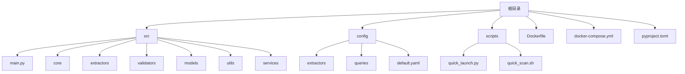
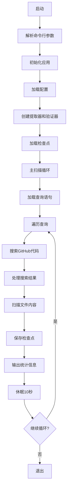

# 部署方案

<cite>
**本文档引用的文件**  
- [Dockerfile](file://Dockerfile) - *重构了构建流程和依赖安装*
- [docker-compose.yml](file://docker-compose.yml) - *更新了服务编排和配置模式*
- [src/main.py](file://src\main.py) - *更新了主入口和扫描模式逻辑*
- [src/core/scanner.py](file://src\core\scanner.py) - *核心扫描器实现*
- [src/models/config.py](file://src\models\config.py) - *配置模型定义*
</cite>

## 更新摘要
**变更内容**  
- 更新了 `Dockerfile` 构建流程说明，反映新的分层复制和依赖安装方式
- 重写了 `docker-compose.yml` 编排说明，支持多模式扫描服务
- 新增了主应用入口 `src/main.py` 的执行流程解析
- 移除了过时的 `first_deploy.sh` 脚本相关内容
- 更新了生产环境部署建议以匹配新架构
- 修正了项目结构分析以反映实际目录布局

## 目录
1. [部署概述](#部署概述)
2. [项目结构分析](#项目结构分析)
3. [Dockerfile 构建解析](#dockerfile-构建解析)
4. [docker-compose.yml 编排说明](#docker-composeyml-编排说明)
5. [主应用入口解析](#主应用入口解析)
6. [生产环境部署建议](#生产环境部署建议)
7. [故障排查指南](#故障排查指南)
8. [多场景部署示例](#多场景部署示例)

## 部署概述

本项目提供了一套现代化的容器化部署方案，支持多种扫描模式。系统基于 Docker 容器技术，利用 `Dockerfile` 构建应用镜像，并通过 `docker-compose.yml` 实现多模式服务编排管理。核心功能为扫描 GitHub 公开代码库中的 API 密钥（如 Google Gemini、ModelScope、OpenRouter），具备增量扫描、代理支持、密钥验证与同步机制。

**Section sources**  
- [Dockerfile](file://Dockerfile#L1-L53)
- [docker-compose.yml](file://docker-compose.yml#L1-L98)
- [src/main.py](file://src\main.py#L1-L452)

## 项目结构分析

项目采用模块化设计，结构清晰，职责分明：



- **src/**: 主应用源码，包含核心模块
- **config/**: 配置文件，包括提取器配置、查询语句等
- **scripts/**: 辅助脚本
- **根目录文件**: `Dockerfile` 和 `docker-compose.yml` 支持容器化部署

**Diagram sources**  
- [src/main.py](file://src\main.py#L1-L452)
- [src/models/config.py](file://src\models\config.py#L1-L112)

## Dockerfile 构建解析

```mermaid
flowchart TD
A[基础镜像 python:3.11-slim] --> B[设置工作目录 /app]
B --> C[安装系统依赖 git, curl]
C --> D[安装uv包管理器]
D --> E[复制依赖文件 pyproject.toml]
E --> F[使用uv安装Python依赖]
F --> G[复制源码 src/, scripts/, config/]
G --> H[创建数据目录 data/{keys,logs}]
H --> I[创建默认查询文件]
I --> J[设置卷 /app/data]
J --> K[暴露端口 8080]
K --> L[启动命令 python -m src.main --mode compatible]
```

### 构建指令详解

| 指令 | 说明 |
|------|------|
| `FROM registry-1.docker.io/library/python:3.11-slim` | 选用轻量级 Python 3.11 镜像，减少体积 |
| `WORKDIR /app` | 设置容器内工作目录 |
| `ENV PYTHONPATH=/app` | 确保模块导入路径正确 |
| `ENV PYTHONUNBUFFERED=1` | 实时输出日志，便于调试 |
| `RUN apt-get update && apt-get install -y git curl` | 安装必要系统工具 |
| `RUN pip install uv` | 安装现代 Python 包管理器 uv，提升依赖安装效率 |
| `COPY pyproject.toml .` | 复制依赖声明文件 |
| `RUN uv pip install --system --no-cache -r pyproject.toml` | 使用 uv 安装生产依赖，`--no-cache` 减小镜像体积 |
| `COPY src/ ./src/` | 复制核心源码 |
| `COPY scripts/ ./scripts/` | 复制脚本文件 |
| `COPY config/ ./config/` | 复制配置文件 |
| `COPY .env.template .` | 复制环境变量模板 |
| `RUN mkdir -p data/{keys,logs}` | 创建数据目录结构 |
| `RUN echo '# 三种API密钥搜索查询' > data/queries.txt` | 生成默认查询文件 |
| `VOLUME ["/app/data"]` | 声明数据卷，实现持久化存储 |
| `EXPOSE 8080` | 暴露端口（为未来的Web界面预留） |
| `CMD ["python", "-m", "src.main", "--mode", "compatible"]` | 定义默认启动命令 |

**Diagram sources**  
- [Dockerfile](file://Dockerfile#L1-L53)

**Section sources**  
- [Dockerfile](file://Dockerfile#L1-L53)

## docker-compose.yml 编排说明

该文件定义了多模式服务编排：

```yaml
version: '3.8'

services:
  # 全面验证模式
  apikey-king-full:
    image: apikey-king:latest
    container_name: apikey-king-full
    restart: unless-stopped
    environment:
      - GITHUB_TOKENS=${GITHUB_TOKENS}
      - GEMINI_VALIDATION_ENABLED=true
      - OPENROUTER_VALIDATION_ENABLED=true
      - MODELSCOPE_VALIDATION_ENABLED=true
    volumes:
      - ./data/full:/app/data
      - ./config/queries:/app/config/queries:ro
    command: ["python", "-m", "src.main", "--mode", "compatible"]
    profiles: ["full", "all"]

  # Gemini 专扫模式
  apikey-king-gemini:
    image: apikey-king:latest
    container_name: apikey-king-gemini
    restart: unless-stopped
    environment:
      - GITHUB_TOKENS=${GITHUB_TOKENS}
      - GEMINI_VALIDATION_ENABLED=true
    volumes:
      - ./data/gemini:/app/data
      - ./config/queries/gemini.txt:/app/data/queries.txt:ro
    command: ["python", "-m", "src.main", "--mode", "gemini-only"]
    profiles: ["gemini", "modes"]

  # OpenRouter 专扫模式
  apikey-king-openrouter:
    image: apikey-king:latest
    container_name: apikey-king-openrouter
    restart: unless-stopped
    environment:
      - GITHUB_TOKENS=${GITHUB_TOKENS}
      - OPENROUTER_VALIDATION_ENABLED=true
    volumes:
      - ./data/openrouter:/app/data
      - ./config/queries/openrouter.txt:/app/data/queries.txt:ro
    command: ["python", "-m", "src.main", "--mode", "openrouter-only"]
    profiles: ["openrouter", "modes"]

  # ModelScope 专扫模式
  apikey-king-modelscope:
    image: apikey-king:latest
    container_name: apikey-king-modelscope
    restart: unless-stopped
    environment:
      - GITHUB_TOKENS=${GITHUB_TOKENS}
      - MODELSCOPE_VALIDATION_ENABLED=true
    volumes:
      - ./data/modelscope:/app/data
      - ./config/queries/modelscope.txt:/app/data/queries.txt:ro
    command: ["python", "-m", "src.main", "--mode", "modelscope-only"]
    profiles: ["modelscope", "modes"]

networks:
  default:
    driver: bridge

volumes:
  data:
    driver: local
```

### 配置项说明

| 配置项 | 说明 |
|--------|------|
| `image` | 使用本地构建的 `apikey-king:latest` 镜像 |
| `container_name` | 指定容器名称，便于管理 |
| `restart: unless-stopped` | 自动重启策略，除非手动停止 |
| `environment` | 从环境变量加载配置，支持密钥验证开关 |
| `volumes` | 数据目录挂载实现持久化，查询文件只读挂载 |
| `command` | 覆盖默认命令，指定扫描模式 |
| `profiles` | 支持按配置文件启动特定服务组 |

**Section sources**  
- [docker-compose.yml](file://docker-compose.yml#L1-L98)

## 主应用入口解析

`src/main.py` 是应用的主入口，实现了多模式扫描逻辑：



### 核心功能

1. **模式化配置**：通过 `--mode` 参数支持 `compatible`、`gemini-only`、`openrouter-only`、`modelscope-only` 四种模式
2. **动态配置**：根据模式自动启用相应的提取器和验证器
3. **增量扫描**：通过检查点机制避免重复扫描
4. **灵活查询**：支持自定义查询文件路径
5. **预设配置**：支持通过 `--config-preset` 加载预设配置

**Section sources**  
- [src/main.py](file://src\main.py#L1-L452)
- [src/core/scanner.py](file://src\core\scanner.py#L1-L79)
- [src/models/config.py](file://src\models\config.py#L1-L112)

## 生产环境部署建议

### 资源限制
在 `docker-compose.yml` 中添加资源限制：
```yaml
deploy:
  resources:
    limits:
      cpus: '2'
      memory: 4G
    reservations:
      memory: 1G
```

### 日志收集
配置日志驱动：
```yaml
logging:
  driver: "json-file"
  options:
    max-size: "10m"
    max-file: "3"
```

### 监控集成
- 使用 Prometheus + Grafana 监控容器资源使用
- 在应用中暴露 `/metrics` 端点
- 配置日志告警（如 ELK + Alertmanager）

### 安全加固措施
1. **最小权限原则**：
   - 创建专用用户运行容器
   - 避免使用 `root` 用户
2. **镜像扫描**：
   - 使用 Trivy、Clair 等工具扫描基础镜像漏洞
   - 定期更新基础镜像
3. **环境变量保护**：
   - `.env` 文件设置 `chmod 600`
   - 不在代码中硬编码敏感信息
4. **网络隔离**：
   - 使用自定义 bridge 网络
   - 配置防火墙规则

**Section sources**  
- [docker-compose.yml](file://docker-compose.yml#L1-L98)
- [src/main.py](file://src\main.py#L1-L452)

## 故障排查指南

### 容器启动失败
- **现象**：`docker-compose up` 报错
- **排查步骤**：
  1. 运行 `docker logs <container_name>` 查看错误日志
  2. 确认 `.env` 文件中 `GITHUB_TOKENS` 已正确配置
  3. 检查 `data/` 目录权限

### 网络连接超时
- **现象**：无法访问 GitHub API
- **解决方案**：
  1. 在 `.env` 中配置 `PROXY` 代理
  2. 检查主机网络是否可达

### 权限问题
- **现象**：无法写入 `data/` 目录
- **解决方案**：
  1. 确保部署目录有写权限：`chmod -R 755 ./data`
  2. 检查容器用户与宿主机用户 UID 是否冲突

### 密钥提取为空
- **现象**：未发现有效密钥
- **排查**：
  1. 检查对应模式的查询文件是否合理
  2. 确认 `FILE_PATH_BLACKLIST` 未误过滤目标文件
  3. 验证 `GITHUB_TOKENS` 权限是否包含 `public_repo`

**Section sources**  
- [src/main.py](file://src\main.py#L1-L452)
- [Dockerfile](file://Dockerfile#L1-L53)
- [docker-compose.yml](file://docker-compose.yml#L1-L98)

## 多场景部署示例

### 开发调试模式
```bash
# 启动全面验证模式
docker-compose --profile full up

# 启动Gemini专扫模式
docker-compose --profile gemini up

# 查看实时日志
docker-compose logs -f apikey-king-full
```

### 持续扫描模式
在 `.env` 中配置：
```env
GITHUB_TOKENS=your_token_here
PROXY=http://proxy:port
```
结合 `cron` 定时执行：
```bash
# 每天凌晨执行一次完整扫描
0 0 * * * cd /deploy/path && docker-compose --profile full up --force-recreate
```

### 集群部署模式
使用 Kubernetes 编排：
```yaml
apiVersion: apps/v1
kind: Deployment
metadata:
  name: apikey-king
spec:
  replicas: 3
  selector:
    matchLabels:
      app: apikey-king
  template:
    metadata:
      labels:
        app: apikey-king
    spec:
      containers:
      - name: scanner
        image: apikey-king:latest
        envFrom:
        - configMapRef:
            name: scanner-config
        volumeMounts:
        - name: data
          mountPath: /app/data
      volumes:
      - name: data
        hostPath:
          path: /data/apikey-king
```

**Section sources**  
- [docker-compose.yml](file://docker-compose.yml#L1-L98)
- [src/main.py](file://src\main.py#L1-L452)