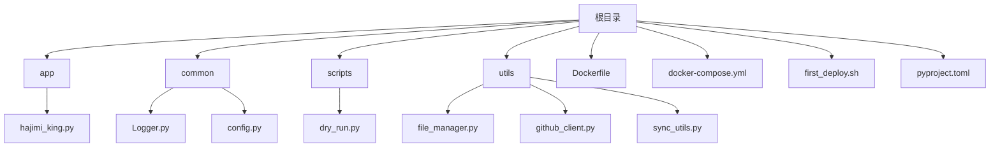
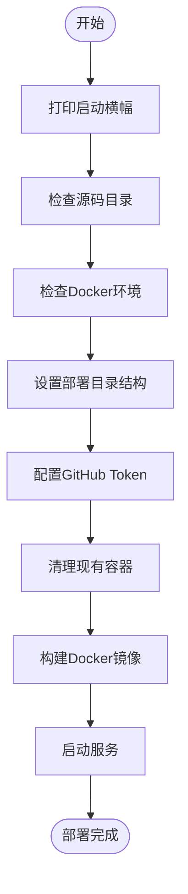
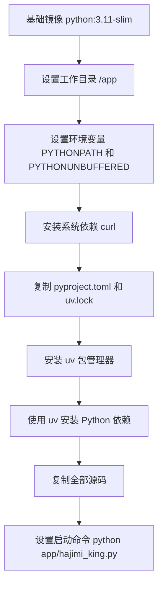

# 部署方案

<cite>
**本文档引用的文件**  
- [first_deploy.sh](file://first_deploy.sh)
- [Dockerfile](file://Dockerfile)
- [docker-compose.yml](file://docker-compose.yml)
- [app/hajimi_king.py](file://app/hajimi_king.py)
- [common/config.py](file://common/config.py)
- [common/Logger.py](file://common/Logger.py)
</cite>

## 目录
1. [部署概述](#部署概述)
2. [项目结构分析](#项目结构分析)
3. [first_deploy.sh 脚本详解](#first_deploysh-脚本详解)
4. [Dockerfile 构建解析](#dockerfile-构建解析)
5. [docker-compose.yml 编排说明](#docker-composeyml-编排说明)
6. [生产环境部署建议](#生产环境部署建议)
7. [故障排查指南](#故障排查指南)
8. [多场景部署示例](#多场景部署示例)

## 部署概述

本项目提供了一套完整的自动化部署方案，支持本地独立部署与容器化运行。通过 `first_deploy.sh` 脚本可实现一键初始化配置、构建镜像并启动服务。系统基于 Docker 容器技术，利用 `Dockerfile` 构建应用镜像，并通过 `docker-compose.yml` 实现多容器编排管理。核心功能为扫描 GitHub 公开代码库中的 API 密钥（如 Google Gemini、ModelScope），具备增量扫描、代理支持、密钥验证与同步机制。

**Section sources**  
- [first_deploy.sh](file://first_deploy.sh#L1-L275)
- [Dockerfile](file://Dockerfile#L1-L26)
- [docker-compose.yml](file://docker-compose.yml#L1-L14)

## 项目结构分析

项目采用模块化设计，结构清晰，职责分明：



- **app/**: 主应用逻辑，包含核心扫描与处理逻辑
- **common/**: 公共组件，如日志、配置管理
- **utils/**: 工具类模块，负责文件操作、GitHub 接口调用等
- **scripts/**: 辅助脚本
- **根目录脚本**: `first_deploy.sh` 为部署入口，`Dockerfile` 和 `docker-compose.yml` 支持容器化

**Diagram sources**  
- [app/hajimi_king.py](file://app/hajimi_king.py#L1-L523)
- [common/config.py](file://common/config.py#L1-L203)
- [utils/github_client.py](file://utils/github_client.py)

**Section sources**  
- [app/hajimi_king.py](file://app/hajimi_king.py#L1-L523)
- [common/config.py](file://common/config.py#L1-L203)

## first_deploy.sh 脚本详解

该脚本是项目部署的核心自动化工具，执行流程如下：



### 执行流程解析

1. **打印横幅**：显示项目名称、镜像标签、源码与部署路径等信息
2. **源码检查**：验证 `Dockerfile`、`env.example`、`queries.example` 等关键文件是否存在
3. **Docker 环境检查**：确保 `docker` 与 `docker-compose` 命令可用且守护进程运行
4. **部署目录初始化**：
   - 创建 `data/` 目录用于持久化数据
   - 复制 `.env` 配置模板
   - 复制 `queries.txt` 查询文件
   - 复制 `docker-compose.yml` 编排文件
5. **GitHub Token 配置**：
   - 检测 `.env` 中是否已配置有效 Token
   - 若未配置，交互式提示用户输入（支持多 Token 逗号分隔）
   - 自动更新 `.env` 文件
6. **清理旧容器**：停止并移除已存在的同名服务容器
7. **构建镜像**：在源码目录执行 `docker build`，生成 `hajimi-king:0.0.1` 镜像
8. **启动服务**：在部署目录运行 `docker-compose up -d` 启动容器

**Diagram sources**  
- [first_deploy.sh](file://first_deploy.sh#L1-L275)

**Section sources**  
- [first_deploy.sh](file://first_deploy.sh#L1-L275)

## Dockerfile 构建解析



### 构建指令详解

| 指令 | 说明 |
|------|------|
| `FROM registry-1.docker.io/library/python:3.11-slim` | 选用轻量级 Python 3.11 镜像，减少体积 |
| `WORKDIR /app` | 设置容器内工作目录 |
| `ENV PYTHONPATH=/app` | 确保模块导入路径正确 |
| `ENV PYTHONUNBUFFERED=1` | 实时输出日志，便于调试 |
| `RUN apt-get update && apt-get install -y curl` | 安装必要系统工具 |
| `COPY pyproject.toml uv.lock ./` | 分层复制依赖文件，利用 Docker 缓存优化构建速度 |
| `RUN pip install uv` | 安装现代 Python 包管理器 uv，提升依赖安装效率 |
| `RUN uv pip install --system --no-cache -r pyproject.toml` | 使用 uv 安装生产依赖，`--no-cache` 减小镜像体积 |
| `COPY . .` | 复制全部源码（在依赖安装后，避免频繁重建） |
| `CMD ["python", "app/hajimi_king.py"]` | 定义容器启动命令 |

**Diagram sources**  
- [Dockerfile](file://Dockerfile#L1-L26)

**Section sources**  
- [Dockerfile](file://Dockerfile#L1-L26)

## docker-compose.yml 编排说明

该文件定义了服务的运行时配置：

```yaml
version: '3.8'

services:
  hajimi-king:
    image: hajimi-king:0.0.1
    container_name: hajimi-king
    restart: unless-stopped
    network_mode: host
    env_file:
      - .env
    volumes:
      - ./data:/app/data
```

### 配置项说明

| 配置项 | 说明 |
|--------|------|
| `image` | 使用本地构建的 `hajimi-king:0.0.1` 镜像 |
| `container_name` | 指定容器名称，便于管理 |
| `restart: unless-stopped` | 自动重启策略，除非手动停止 |
| `network_mode: host` | 使用主机网络模式，提升网络性能，共享主机端口 |
| `env_file` | 从 `.env` 文件加载环境变量，实现配置与代码分离 |
| `volumes` | 将本地 `./data` 目录挂载到容器 `/app/data`，实现数据持久化 |

**Section sources**  
- [docker-compose.yml](file://docker-compose.yml#L1-L14)

## 生产环境部署建议

### 资源限制
在 `docker-compose.yml` 中添加资源限制，防止资源耗尽：
```yaml
deploy:
  resources:
    limits:
      cpus: '2'
      memory: 4G
    reservations:
      memory: 1G
```

### 日志收集
配置日志驱动，将日志输出到外部系统：
```yaml
logging:
  driver: "json-file"
  options:
    max-size: "10m"
    max-file: "3"
```

### 监控集成
- 使用 Prometheus + Grafana 监控容器资源使用
- 在应用中暴露 `/metrics` 端点，记录扫描进度、密钥数量等指标
- 配置日志告警（如 ELK + Alertmanager）

### 安全加固措施
1. **最小权限原则**：
   - 创建专用用户运行容器
   - 避免使用 `root` 用户
   - 限制容器能力（`cap_drop`）
2. **镜像扫描**：
   - 使用 Trivy、Clair 等工具扫描基础镜像漏洞
   - 定期更新基础镜像
3. **环境变量保护**：
   - `.env` 文件设置 `chmod 600`
   - 不在代码中硬编码敏感信息
4. **网络隔离**：
   - 生产环境避免使用 `host` 网络模式
   - 使用自定义 bridge 网络并配置防火墙规则

**Section sources**  
- [docker-compose.yml](file://docker-compose.yml#L1-L14)
- [common/config.py](file://common/config.py#L1-L203)

## 故障排查指南

### 容器启动失败
- **现象**：`docker-compose up` 报错
- **排查步骤**：
  1. 检查 `first_deploy.sh` 是否执行成功
  2. 运行 `docker logs hajimi-king` 查看错误日志
  3. 确认 `.env` 文件中 `GITHUB_TOKENS` 已正确配置
  4. 检查 `data/` 目录权限

### 网络连接超时
- **现象**：无法访问 GitHub API
- **解决方案**：
  1. 在 `.env` 中配置 `PROXY` 代理
  2. 检查主机网络是否可达
  3. 调整 `Config.DATE_RANGE_DAYS` 减少查询范围

### 权限问题
- **现象**：无法写入 `data/` 目录
- **解决方案**：
  1. 确保部署目录有写权限：`chmod -R 755 ./data`
  2. 检查容器用户与宿主机用户 UID 是否冲突
  3. 使用 `chown` 修复目录所有权

### 密钥提取为空
- **现象**：未发现有效密钥
- **排查**：
  1. 检查 `queries.txt` 查询语句是否合理
  2. 确认 `FILE_PATH_BLACKLIST` 未误过滤目标文件
  3. 验证 `GITHUB_TOKENS` 权限是否包含 `public_repo`

**Section sources**  
- [app/hajimi_king.py](file://app/hajimi_king.py#L1-L523)
- [common/config.py](file://common/config.py#L1-L203)
- [first_deploy.sh](file://first_deploy.sh#L1-L275)

## 多场景部署示例

### 开发调试模式
```bash
# 本地运行，实时查看日志
docker-compose logs -f

# 修改代码后重新构建
docker-compose build && docker-compose up -d
```

### 持续扫描模式
在 `.env` 中配置：
```env
DATE_RANGE_DAYS=30
MODELSCOPE_EXTRACT_ONLY=false
```
结合 `cron` 定时执行：
```bash
# 每天凌晨执行一次完整扫描
0 0 * * * cd /deploy/path && ./first_deploy.sh
```

### 集群部署模式
使用 Kubernetes 编排：
```yaml
apiVersion: apps/v1
kind: Deployment
metadata:
  name: hajimi-king
spec:
  replicas: 3
  selector:
    matchLabels:
      app: hajimi-king
  template:
    metadata:
      labels:
        app: hajimi-king
    spec:
      containers:
      - name: scanner
        image: hajimi-king:0.0.1
        envFrom:
        - configMapRef:
            name: scanner-config
        volumeMounts:
        - name: data
          mountPath: /app/data
      volumes:
      - name: data
        hostPath:
          path: /data/hajimi-king
```

**Section sources**  
- [docker-compose.yml](file://docker-compose.yml#L1-L14)
- [common/config.py](file://common/config.py#L1-L203)