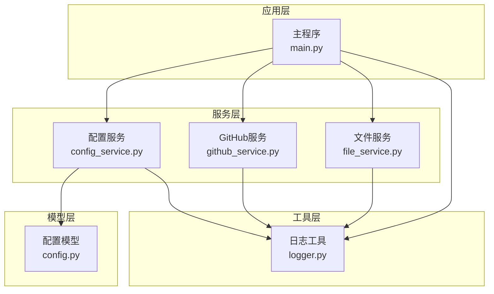
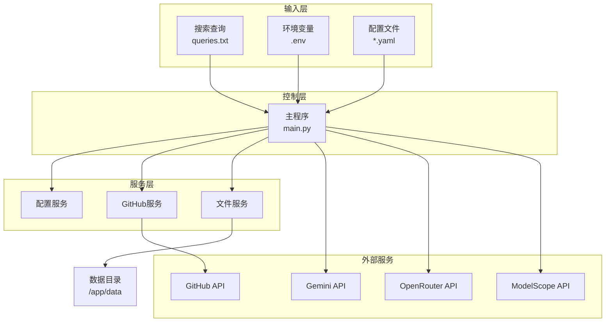
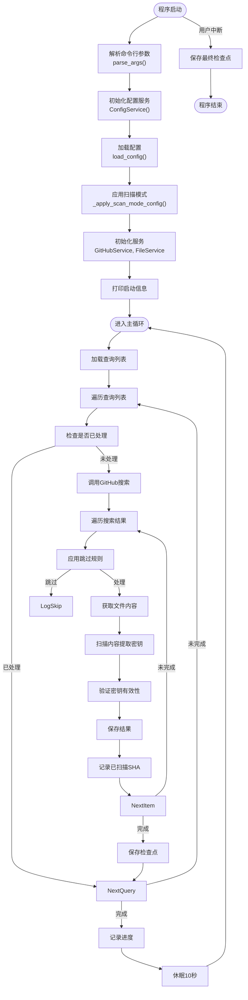
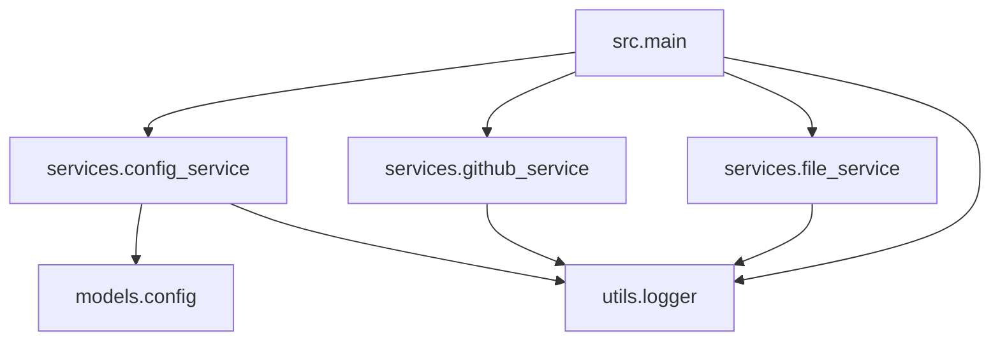

# 项目概述

<cite>
**本文档引用的文件**   
- [src/main.py](file://src/main.py) - *重构后的主程序入口*
- [src/models/config.py](file://src/models/config.py) - *配置模型定义*
- [src/services/config_service.py](file://src/services/config_service.py) - *配置服务实现*
- [src/utils/logger.py](file://src/utils/logger.py) - *日志服务实现*
- [src/services/github_service.py](file://src/services/github_service.py) - *GitHub服务实现*
- [src/services/file_service.py](file://src/services/file_service.py) - *文件服务实现*
- [README.md](file://README.md) - *项目说明文档*
- [config/default.yaml](file://config/default.yaml) - *默认配置文件*
- [config/extractors/modelscope.yaml](file://config/extractors/modelscope.yaml) - *ModelScope提取器配置*
- [config/extractors/openrouter.yaml](file://config/extractors/openrouter.yaml) - *OpenRouter提取器配置*
- [config/queries/modelscope.txt](file://config/queries/modelscope.txt) - *ModelScope查询文件*
- [config/queries/openrouter.txt](file://config/queries/openrouter.txt) - *OpenRouter查询文件*
</cite>

## 更新摘要
**已做更改**   
- 重构项目结构，主程序入口从 `app/hajimi_king.py` 迁移至 `src/main.py`
- 采用模块化配置管理，提取器和验证器配置从环境变量迁移至YAML配置文件
- 更新系统架构概览图以反映新的服务分层设计
- 在使用指南中增加基于配置预设的运行示例
- 重构日志系统，支持双语输出和更丰富的日志级别
- 更新核心组件分析以反映新的服务层设计
- 修正主程序流程图以反映新的扫描模式控制逻辑

## 目录
1. [项目概述](#项目概述)
2. [项目结构分析](#项目结构分析)
3. [核心组件分析](#核心组件分析)
4. [系统架构概览](#系统架构概览)
5. [详细组件分析](#详细组件分析)
6. [依赖关系分析](#依赖关系分析)
7. [性能与安全注意事项](#性能与安全注意事项)
8. [使用指南与示例](#使用指南与示例)
9. [结论](#结论)

## 项目结构分析

APIKEY-king 是一个基于命令行的自动化工具，旨在通过 GitHub API 搜索并提取 ModelScope、Gemini 和 OpenRouter 平台的有效 API 密钥。项目采用现代化的模块化设计，结构清晰，各组件职责分明。

项目主要由以下几个目录构成：
- `src/`：源代码目录，包含所有核心功能模块。
- `config/`：配置文件目录，包含提取器、验证器和查询的YAML配置。
- `scripts/`：脚本文件，用于特定场景的测试或部署。
- `tests/`：测试代码目录，包含单元测试和集成测试。
- 根目录下包含文档、Docker配置和项目元数据文件。



**图示来源**
- [src/main.py](file://src/main.py)
- [src/services/config_service.py](file://src/services/config_service.py)
- [src/services/github_service.py](file://src/services/github_service.py)
- [src/services/file_service.py](file://src/services/file_service.py)
- [src/models/config.py](file://src/models/config.py)
- [src/utils/logger.py](file://src/utils/logger.py)

**本节来源**
- [README.md](file://README.md)

## 核心组件分析

### 日志模块 (logger.py)

日志模块提供了统一且功能丰富的日志输出接口，支持双语（中文/英文）输出，便于不同语言背景的用户理解。支持多种级别的日志记录（debug、info、warning、error、critical），并为不同级别设置了颜色标识和表情图标，便于在终端中快速识别日志类型。

```python
class Logger:
    def debug(self, message: str):
        self._safe_log(self._logger.debug, message)

    def info(self, message: str):
        self._safe_log(self._logger.info, message)

    def warning(self, message: str):
        self._safe_log(self._logger.warning, message)

    def error(self, message: str):
        self._safe_log(self._logger.error, message)

    def success(self, message: str):
        bilingual_msg = f"✅ 成功 Success: {message}"
        self._safe_log(self._logger.info, bilingual_msg)

    def init_success(self, component: str, details: str = ""):
        msg = f"✅ {component} 初始化成功 Initialized Successfully"
        if details:
            msg += f" - {details}"
        self.info(msg)
```

该模块使用 Python 内置的 `logging` 模块进行底层日志处理，并通过 `ColoredFormatter` 类实现带颜色和图标的格式化输出。它还支持文件日志记录，将详细日志写入 `data/logs/` 目录下的日期命名文件中。模块具有良好的兼容性，能够优雅地处理Windows系统下的emoji编码问题。

**本节来源**
- [src/utils/logger.py](file://src/utils/logger.py#L1-L260)

### 配置管理模块 (config.py)

配置模块 `config.py` 采用数据类（dataclass）定义配置模型，通过分层配置机制实现灵活的配置管理。配置优先级为：环境变量 > YAML配置文件 > 默认值。

关键配置模型包括：
- `AppConfig`：主应用配置，包含数据路径、代理列表等。
- `GitHubConfig`：GitHub API配置，包含访问令牌和API端点。
- `ScanConfig`：扫描配置，包含日期范围、文件路径黑名单等。
- `ExtractorConfig`：提取器配置，定义了各平台密钥的提取规则。
- `ValidatorConfig`：验证器配置，定义了各平台密钥的验证参数。

```python
@dataclass
class AppConfig:
    data_path: str = "./data"
    proxy_list: List[str] = field(default_factory=list)
    github: GitHubConfig = field(default_factory=GitHubConfig)
    scan: ScanConfig = field(default_factory=ScanConfig)
    extractors: Dict[str, ExtractorConfig] = field(default_factory=dict)
    validators: Dict[str, ValidatorConfig] = field(default_factory=dict)
    
    def get_proxy_configs(self) -> List[ProxyConfig]:
        return [ProxyConfig.from_string(proxy) for proxy in self.proxy_list if proxy.strip()]
    
    def get_enabled_extractors(self) -> Dict[str, ExtractorConfig]:
        return {name: config for name, config in self.extractors.items() if config.enabled}
    
    def get_enabled_validators(self) -> Dict[str, ValidatorConfig]:
        return {name: config for name, config in self.validators.items() if config.enabled}
```

配置模块通过 `ConfigService` 从多个来源（YAML文件、环境变量）加载配置，并提供类型安全的访问接口。

**本节来源**
- [src/models/config.py](file://src/models/config.py#L1-L112)

## 系统架构概览

APIKEY-king 的整体架构遵循清晰的分层设计，主要包括以下几个核心组件：



**图示来源**
- [src/main.py](file://src/main.py)
- [src/services/config_service.py](file://src/services/config_service.py)
- [src/services/github_service.py](file://src/services/github_service.py)
- [src/services/file_service.py](file://src/services/file_service.py)
- [README.md](file://README.md)

**本节来源**
- [README.md](file://README.md)

## 详细组件分析

### 主程序流程 (main.py)

主程序 `main.py` 是整个系统的控制中心，其执行流程如下：



**图示来源**
- [src/main.py](file://src/main.py#L1-L452)

**本节来源**
- [src/main.py](file://src/main.py#L1-L452)

### 密钥提取逻辑

项目支持三种密钥提取模式：ModelScope 模式、OpenRouter 模式和 Gemini 兼容模式。

#### ModelScope 密钥提取

当配置了 `modelscope` 提取器时，程序会尝试从文件内容中提取符合 `ms-UUID` 格式的密钥。提取过程包含以下步骤：
1. 检查文件内容是否包含任一配置的 base_url。
2. 使用正则表达式匹配 `ms-UUID` 格式的字符串。
3. 可选地应用距离约束（`proximity_chars`）和上下文关键词过滤（`require_key_context`）。

```python
def extract_ms_keys_for_modelscope(content: str) -> List[str]:
    base_urls = config.base_urls
    has_base, base_positions = _contains_base_url(content, base_urls)
    if not has_base:
        return []
    pattern = loose_pat if use_loose else strict_pat
    # ... 匹配逻辑
    return deduped
```

#### OpenRouter 密钥提取

当配置了 `openrouter` 提取器时，程序会尝试从文件内容中提取符合 `sk-or-v1-[64位十六进制]` 格式的 OpenRouter 密钥。提取过程包含以下步骤：
1. 检查文件内容是否包含任一配置的 base_url。
2. 使用正则表达式匹配 `sk-or-v1-[64位十六进制]` 格式的字符串。
3. 可选地应用距离约束（`proximity_chars`）和上下文关键词过滤（`require_key_context`）。
4. 自动过滤明显的占位符密钥。

```python
def extract_openrouter_keys(content: str) -> List[str]:
    base_urls = config.base_urls
    has_base, base_positions = _contains_base_url(content, base_urls)
    if not has_base:
        return []
    pattern = loose_pat if use_loose else strict_pat
    # ... 匹配逻辑
    return deduped
```

#### Gemini 密钥提取

对于未命中 ModelScope 或 OpenRouter 密钥的情况，程序会回退到传统的 Gemini 密钥提取逻辑，使用正则表达式 `r'(AIzaSy[A-Za-z0-9\-_]{33})'` 提取密钥，并通过调用 Gemini API 进行有效性验证。

**本节来源**
- [src/main.py](file://src/main.py#L1-L452)

### 文件服务 (file_service.py)

文件服务负责所有与文件相关的操作，包括：
- 加载和保存检查点（checkpoint）。
- 管理已扫描文件的 SHA 记录。
- 动态生成按日期命名的输出文件。
- 保存有效密钥、限流密钥。

`Checkpoint` 类使用 `dataclass` 定义，包含扫描时间、已处理查询、已扫描 SHA 等信息。

```python
@dataclass
class Checkpoint:
    last_scan_time: Optional[str] = None
    scanned_shas: Set[str] = field(default_factory=set)
    processed_queries: Set[str] = field(default_factory=set)
    
    def to_dict(self) -> Dict[str, Any]:
        return {
            'last_scan_time': self.last_scan_time,
            'scanned_shas': list(self.scanned_shas),
            'processed_queries': list(self.processed_queries)
        }
    
    @classmethod
    def from_dict(cls, data: Dict[str, Any]) -> 'Checkpoint':
        checkpoint = cls()
        if 'last_scan_time' in data:
            checkpoint.last_scan_time = data['last_scan_time']
        if 'scanned_shas' in data:
            checkpoint.scanned_shas = set(data['scanned_shas'])
        if 'processed_queries' in data:
            checkpoint.processed_queries = set(data['processed_queries'])
        return checkpoint
```

文件服务实现了增量扫描机制，通过检查点避免重复处理已扫描的文件，提高效率。

**本节来源**
- [src/services/file_service.py](file://src/services/file_service.py#L1-L217)

### GitHub 服务 (github_service.py)

GitHub 服务封装了与 GitHub API 的交互逻辑，主要功能包括：
- 使用轮换的 GitHub Token 发起搜索请求。
- 处理速率限制和网络异常。
- 获取文件内容（支持 base64 解码）。

服务实现了重试机制和随机休眠，以应对 API 限流。

```python
class GitHubService:
    def search_code(self, query: str, max_retries: int = 5) -> Dict[str, Any]:
        # ... 实现搜索逻辑
        return result
```

**本节来源**
- [src/services/github_service.py](file://src/services/github_service.py#L1-L256)

## 依赖关系分析

项目各模块之间的依赖关系清晰，遵循低耦合原则。



**图示来源**
- [src/main.py](file://src/main.py)
- [src/services/config_service.py](file://src/services/config_service.py)
- [src/services/github_service.py](file://src/services/github_service.py)
- [src/services/file_service.py](file://src/services/file_service.py)

**本节来源**
- 项目代码依赖分析

## 性能与安全注意事项

### 性能优化

- **多令牌轮换**：通过配置多个 GitHub Token，实现请求轮换，有效规避单个 Token 的速率限制。
- **代理支持**：支持配置代理列表，可结合本地 WARP 代理使用，提高网络稳定性。
- **增量扫描**：通过检查点机制实现断点续传，避免重复扫描，显著提升长期运行效率。
- **专用模式**：使用 `openrouter-only` 或 `modelscope-only` 模式可以跳过其他平台的验证，大大提高扫描速度。
- **配置预设**：使用 `--config-preset` 参数可以快速切换不同的配置组合，提高使用效率。

### 安全注意事项

- **最小权限原则**：GitHub Token 仅需 `public_repo` 权限，避免授予过高权限。
- **环境变量管理**：敏感配置（如 Token、代理密码）通过环境变量注入，不应提交至版本控制。
- **定期轮换**：建议定期更换 GitHub Token 和代理凭证，降低泄露风险。
- **结果清理**：定期检查和清理生成的密钥文件，防止敏感信息长期留存。
- **配置隔离**：使用不同的配置预设来隔离不同平台的扫描任务。

**本节来源**
- [README.md](file://README.md)

## 使用指南与示例

### 基本使用步骤

1. **配置环境变量**：创建 `.env` 文件，设置 `GITHUB_TOKENS` 等必要参数。
2. **准备查询文件**：编辑 `data/queries.txt`，定义搜索表达式。
3. **运行主程序**：
   ```bash
   # 兼容模式（扫描所有类型）
   python -m src.main --mode compatible
   
   # 仅提取ModelScope密钥
   python -m src.main --mode modelscope-only
   
   # 仅提取OpenRouter密钥
   python -m src.main --mode openrouter-only
   
   # 使用配置预设
   python -m src.main --config-preset gemini-only
   ```

### 配置预设模式

项目支持通过配置预设快速切换扫描模式：

```bash
# 使用预设配置
python -m src.main --config-preset modelscope-only
python -m src.main --config-preset openrouter-only
python -m src.main --config-preset gemini-only
```

**本节来源**
- [README.md](file://README.md)
- [src/main.py](file://src/main.py#L1-L452)

### 配置示例

```bash
# .env 文件示例
GITHUB_TOKENS=ghp_token1,ghp_token2
DATA_PATH=./data
PROXY=http://localhost:1080
```

### 输出文件说明

- `data/keys/keys_valid_YYYYMMDD.txt`：有效密钥列表。
- `data/logs/keys_valid_detail_YYYYMMDD.log`：详细日志，包含密钥来源信息。
- `data/checkpoint.json`：检查点数据，用于增量扫描。

**本节来源**
- [README.md](file://README.md)

## 结论

APIKEY-king 是一个功能强大且设计精良的 CLI 工具，专为自动化发现和管理 API 密钥而设计。其现代化的模块化架构、增量扫描机制和灵活的配置选项，使其在安全研究和开发运维场景中具有很高的实用价值。项目代码结构清晰，注释充分，易于理解和扩展。通过遵循最佳安全实践，用户可以高效、安全地利用该工具进行密钥发现和管理。