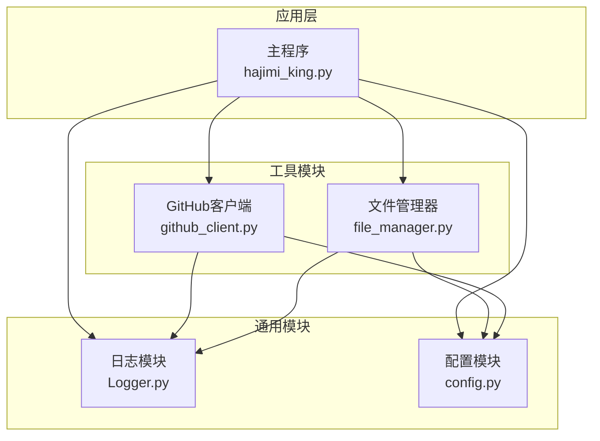
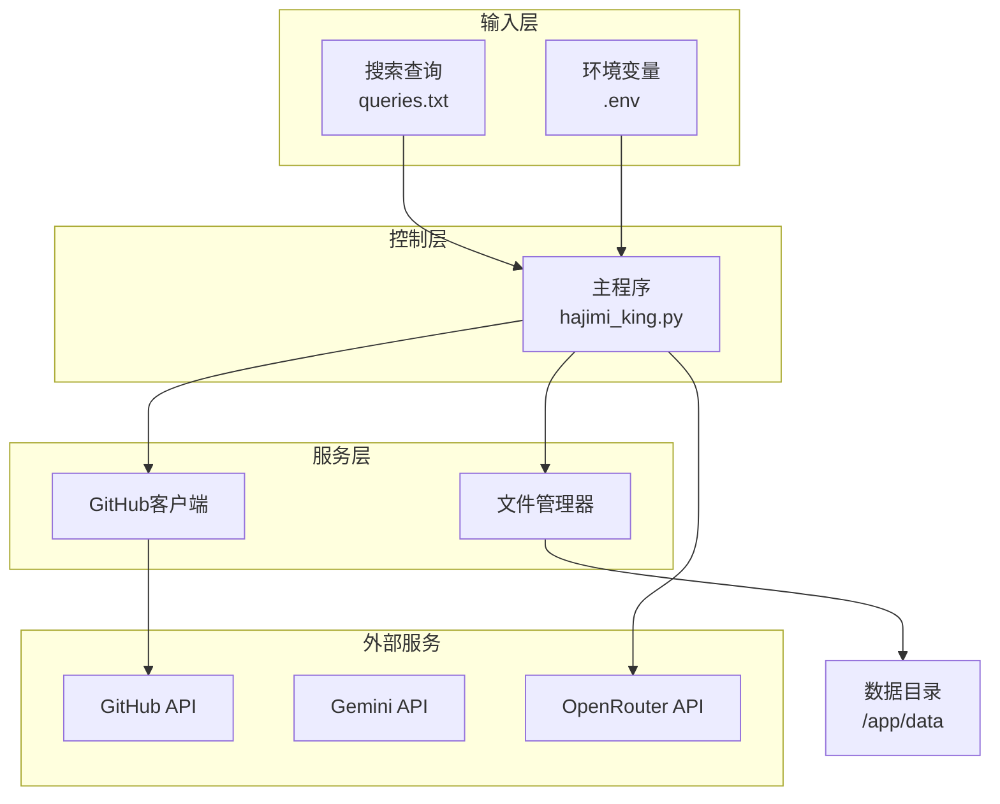
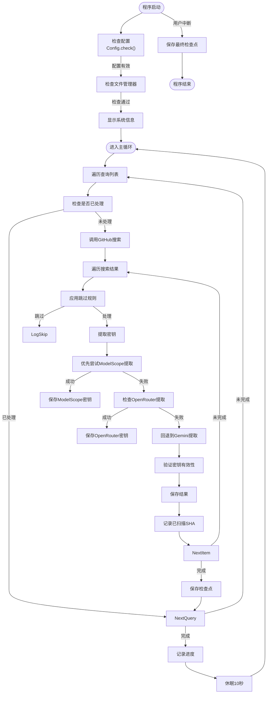
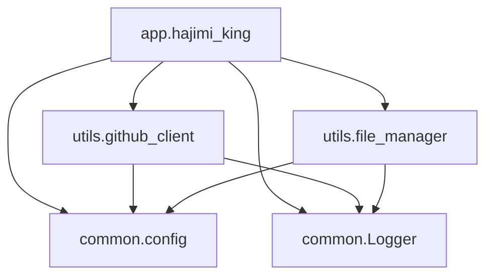

# 项目概述

<cite>
**本文档引用的文件**   
- [app/hajimi_king.py](file://app/hajimi_king.py)
- [common/Logger.py](file://common/Logger.py)
- [common/config.py](file://common/config.py)
- [utils/github_client.py](file://utils/github_client.py)
- [utils/file_manager.py](file://utils/file_manager.py)
- [README.md](file://README.md)
- [OPENROUTER_USAGE.md](file://OPENROUTER_USAGE.md)
- [start_openrouter_only.py](file://start_openrouter_only.py)
</cite>

## 更新摘要
**已做更改**   
- 新增 OpenRouter API 密钥提取功能的详细说明
- 在核心组件分析中添加 OpenRouter 密钥提取逻辑
- 更新系统架构概览图以包含 OpenRouter 相关组件
- 在使用指南中增加 OpenRouter 专用模式的运行示例
- 更新配置管理模块说明以包含 OpenRouter 相关配置项
- 修正主程序流程图以反映新的提取模式分支

## 目录
1. [项目概述](#项目概述)
2. [项目结构分析](#项目结构分析)
3. [核心组件分析](#核心组件分析)
4. [系统架构概览](#系统架构概览)
5. [详细组件分析](#详细组件分析)
6. [依赖关系分析](#依赖关系分析)
7. [性能与安全注意事项](#性能与安全注意事项)
8. [使用指南与示例](#使用指南与示例)
9. [结论](#结论)

## 项目结构分析

APIKEY-king 是一个基于命令行的自动化工具，旨在通过 GitHub API 搜索并提取 ModelScope 和 Gemini 平台的有效 API 密钥。项目采用模块化设计，结构清晰，各组件职责分明。

项目主要由以下几个目录构成：
- `app/`：主程序入口，包含核心执行逻辑。
- `common/`：通用工具模块，如日志记录和配置管理。
- `scripts/`：脚本文件，用于特定场景的测试或部署。
- `utils/`：工具类模块，负责与外部服务交互、文件管理及同步功能。
- 根目录下包含配置文件（如 `.env`）、Docker 配置、启动脚本等。



**图示来源**
- [app/hajimi_king.py](file://app/hajimi_king.py)
- [common/Logger.py](file://common/Logger.py)
- [common/config.py](file://common/config.py)
- [utils/github_client.py](file://utils/github_client.py)
- [utils/file_manager.py](file://utils/file_manager.py)

**本节来源**
- [README.md](file://README.md)

## 核心组件分析

### 日志模块 (Logger.py)

日志模块提供了统一且功能丰富的日志输出接口，支持多种级别的日志记录（debug、info、warning、error、critical），并为不同级别设置了颜色标识和表情图标，便于在终端中快速识别日志类型。

```python
class Logger:
    def debug(self, message: str):
        self._logger.debug(str(message))

    def info(self, message: str):
        self._logger.info(str(message))

    def warning(self, message: str):
        self._logger.warning(str(message))

    def error(self, message: str):
        self._logger.error(str(message))

    def critical(self, message: str):
        self._logger.critical(str(message))

    def success(self, message: str):
        self._logger.info(f"✅ {message}")

    def progress(self, message: str, current: int, total: int):
        percentage = (current / total * 100) if total > 0 else 0
        progress_bar = self._create_progress_bar(current, total)
        self._logger.info(f"📈 {message} {progress_bar} {percentage:.1f}% ({current}/{total})")
```

该模块使用 Python 内置的 `logging` 模块进行底层日志处理，并通过 `ColoredFormatter` 类实现带颜色和图标的格式化输出。它还支持文件日志记录，将详细日志写入 `data/logs/` 目录下的日期命名文件中。

**本节来源**
- [common/Logger.py](file://common/Logger.py#L70-L182)

### 配置管理模块 (config.py)

配置模块 `config.py` 采用单例模式，通过读取环境变量（`.env` 文件）来初始化全局配置。它不仅集中管理所有配置项，还提供了类型转换和布尔值解析功能。

关键配置包括：
- `GITHUB_TOKENS`：用于访问 GitHub API 的令牌列表。
- `PROXY_LIST`：代理服务器列表，支持多种协议。
- `TARGET_BASE_URLS`：ModelScope API 的目标基础 URL。
- `OPENROUTER_BASE_URLS`：OpenRouter API 的目标基础 URL。
- 各类文件路径前缀和黑名单设置。

```python
class Config:
    GITHUB_TOKENS_STR = os.getenv("GITHUB_TOKENS", "")
    GITHUB_TOKENS = [token.strip() for token in GITHUB_TOKENS_STR.split(',') if token.strip()]
    
    # OpenRouter key extraction configuration
    OPENROUTER_BASE_URLS_STR = os.getenv(
        "OPENROUTER_BASE_URLS",
        "https://openrouter.ai/api/v1"
    )
    OPENROUTER_BASE_URLS = [u.strip() for u in OPENROUTER_BASE_URLS_STR.split(',') if u.strip()]
    
    OPENROUTER_USE_LOOSE_PATTERN = os.getenv("OPENROUTER_USE_LOOSE_PATTERN", "false")
    OPENROUTER_PROXIMITY_CHARS = int(os.getenv("OPENROUTER_PROXIMITY_CHARS", "0"))
    OPENROUTER_REQUIRE_KEY_CONTEXT = os.getenv("OPENROUTER_REQUIRE_KEY_CONTEXT", "false")
    OPENROUTER_EXTRACT_ONLY = os.getenv("OPENROUTER_EXTRACT_ONLY", "true")
    
    @classmethod
    def parse_bool(cls, value: str) -> bool:
        return value.strip().lower() in ('true', '1', 'yes', 'on', 'enabled')
```

配置模块在启动时会进行完整性检查，确保必要配置项已正确设置。

**本节来源**
- [common/config.py](file://common/config.py#L1-L187)

## 系统架构概览

APIKEY-king 的整体架构遵循清晰的分层设计，主要包括以下几个核心组件：



**图示来源**
- [app/hajimi_king.py](file://app/hajimi_king.py)
- [utils/github_client.py](file://utils/github_client.py)
- [utils/file_manager.py](file://utils/file_manager.py)
- [OPENROUTER_USAGE.md](file://OPENROUTER_USAGE.md)

**本节来源**
- [README.md](file://README.md)

## 详细组件分析

### 主程序流程 (hajimi_king.py)

主程序 `hajimi_king.py` 是整个系统的控制中心，其执行流程如下：



**图示来源**
- [app/hajimi_king.py](file://app/hajimi_king.py#L1-L596)

**本节来源**
- [app/hajimi_king.py](file://app/hajimi_king.py#L1-L596)

### 密钥提取逻辑

项目支持三种密钥提取模式：ModelScope 模式、OpenRouter 模式和 Gemini 兼容模式。

#### ModelScope 密钥提取

当配置了 `TARGET_BASE_URLS` 时，程序会优先尝试从文件内容中提取符合 `ms-UUID` 格式的密钥。提取过程包含以下步骤：
1. 检查文件内容是否包含任一目标 base_url。
2. 使用正则表达式匹配 `ms-UUID` 格式的字符串。
3. 可选地应用距离约束（`MS_PROXIMITY_CHARS`）和上下文关键词过滤（`MS_REQUIRE_KEY_CONTEXT`）。

```python
def extract_ms_keys_for_modelscope(content: str) -> List[str]:
    base_urls = Config.TARGET_BASE_URLS
    has_base, base_positions = _contains_base_url(content, base_urls)
    if not has_base:
        return []
    pattern = loose_pat if use_loose else strict_pat
    # ... 匹配逻辑
    return deduped
```

#### OpenRouter 密钥提取

当配置了 `OPENROUTER_BASE_URLS` 时，程序会尝试从文件内容中提取符合 `sk-or-v1-[64位十六进制]` 格式的 OpenRouter 密钥。提取过程包含以下步骤：
1. 检查文件内容是否包含任一 OpenRouter base_url。
2. 使用正则表达式匹配 `sk-or-v1-[64位十六进制]` 格式的字符串。
3. 可选地应用距离约束（`OPENROUTER_PROXIMITY_CHARS`）和上下文关键词过滤（`OPENROUTER_REQUIRE_KEY_CONTEXT`）。
4. 自动过滤明显的占位符密钥。

```python
def extract_openrouter_keys(content: str) -> List[str]:
    base_urls = Config.OPENROUTER_BASE_URLS
    has_base, base_positions = _contains_base_url(content, base_urls)
    if not has_base:
        return []
    pattern = loose_pat if use_loose else strict_pat
    # ... 匹配逻辑
    return deduped
```

#### Gemini 密钥提取

对于未命中 ModelScope 或 OpenRouter 密钥的情况，程序会回退到传统的 Gemini 密钥提取逻辑，使用正则表达式 `r'(AIzaSy[A-Za-z0-9\-_]{33})'` 提取密钥，并通过调用 Gemini API 进行有效性验证。

**本节来源**
- [app/hajimi_king.py](file://app/hajimi_king.py#L1-L596)

### 文件管理器 (file_manager.py)

文件管理器负责所有与文件相关的操作，包括：
- 加载和保存检查点（checkpoint）。
- 管理已扫描文件的 SHA 记录。
- 动态生成按日期命名的输出文件。
- 保存有效密钥、限流密钥。

`Checkpoint` 类使用 `dataclass` 定义，包含扫描时间、已处理查询、已扫描 SHA 等信息。

```python
@dataclass
class Checkpoint:
    last_scan_time: Optional[str] = None
    scanned_shas: Set[str] = field(default_factory=set)
    processed_queries: Set[str] = field(default_factory=set)
```

文件管理器实现了增量扫描机制，通过检查点避免重复处理已扫描的文件，提高效率。

**本节来源**
- [utils/file_manager.py](file://utils/file_manager.py#L1-L493)

### GitHub 客户端 (github_client.py)

GitHub 客户端封装了与 GitHub API 的交互逻辑，主要功能包括：
- 使用轮换的 GitHub Token 发起搜索请求。
- 处理速率限制和网络异常。
- 获取文件内容（支持 base64 解码）。

客户端实现了重试机制和随机休眠，以应对 API 限流。

```python
class GitHubClient:
    def search_for_keys(self, query: str, max_retries: int = 5) -> Dict[str, Any]:
        # ... 实现搜索逻辑
        return result
```

**本节来源**
- [utils/github_client.py](file://utils/github_client.py#L1-L218)

## 依赖关系分析

项目各模块之间的依赖关系清晰，遵循低耦合原则。



**图示来源**
- [app/hajimi_king.py](file://app/hajimi_king.py)
- [utils/github_client.py](file://utils/github_client.py)
- [utils/file_manager.py](file://utils/file_manager.py)

**本节来源**
- 项目代码依赖分析

## 性能与安全注意事项

### 性能优化

- **多令牌轮换**：通过配置多个 GitHub Token，实现请求轮换，有效规避单个 Token 的速率限制。
- **代理支持**：支持配置代理列表，可结合本地 WARP 代理使用，提高网络稳定性。
- **增量扫描**：通过检查点机制实现断点续传，避免重复扫描，显著提升长期运行效率。
- **专用模式**：使用 `openrouter-only` 模式可以跳过 Gemini 验证，大大提高扫描速度。

### 安全注意事项

- **最小权限原则**：GitHub Token 仅需 `public_repo` 权限，避免授予过高权限。
- **环境变量管理**：敏感配置（如 Token、代理密码）通过环境变量注入，不应提交至版本控制。
- **定期轮换**：建议定期更换 GitHub Token 和代理凭证，降低泄露风险。
- **结果清理**：定期检查和清理生成的密钥文件，防止敏感信息长期留存。
- **配置隔离**：使用专用的 `.env.openrouter` 配置文件来隔离 OpenRouter 相关配置。

**本节来源**
- [README.md](file://README.md)

## 使用指南与示例

### 基本使用步骤

1. **配置环境变量**：创建 `.env` 文件，设置 `GITHUB_TOKENS` 等必要参数。
2. **准备查询文件**：编辑 `data/queries.txt`，定义搜索表达式。
3. **运行主程序**：
   ```bash
   # 仅提取ModelScope密钥
   python app/hajimi_king.py --mode modelscope-only
   
   # 仅提取OpenRouter密钥
   python app/hajimi_king.py --mode openrouter-only
   
   # 兼容模式（优先ModelScope，失败后回退）
   python app/hajimi_king.py --mode compatible
   ```

### OpenRouter 专用模式

项目提供了专门用于扫描 OpenRouter 密钥的模式：

```bash
# 方法一：使用专用启动脚本
python start_openrouter_only.py

# 方法二：使用命令行参数
python app/hajimi_king.py --mode openrouter-only
```

**本节来源**
- [README.md](file://README.md)
- [OPENROUTER_USAGE.md](file://OPENROUTER_USAGE.md)
- [start_openrouter_only.py](file://start_openrouter_only.py)

### 配置示例

```bash
# .env 文件示例
GITHUB_TOKENS=ghp_token1,ghp_token2
DATA_PATH=./data
MODELSCOPE_EXTRACT_ONLY=true
TARGET_BASE_URLS=https://api-inference.modelscope.cn/v1/
OPENROUTER_EXTRACT_ONLY=true
OPENROUTER_BASE_URLS=https://openrouter.ai/api/v1,openrouter.ai
PROXY=http://localhost:1080
```

### 输出文件说明

- `data/keys/keys_valid_YYYYMMDD.txt`：有效密钥列表。
- `data/logs/keys_valid_detail_YYYYMMDD.log`：详细日志，包含密钥来源信息。
- `data/checkpoint.json`：检查点数据，用于增量扫描。

**本节来源**
- [README.md](file://README.md)

## 结论

APIKEY-king 是一个功能强大且设计精良的 CLI 工具，专为自动化发现和管理 API 密钥而设计。其模块化架构、增量扫描机制和灵活的配置选项，使其在安全研究和开发运维场景中具有很高的实用价值。项目代码结构清晰，注释充分，易于理解和扩展。通过遵循最佳安全实践，用户可以高效、安全地利用该工具进行密钥发现和管理。