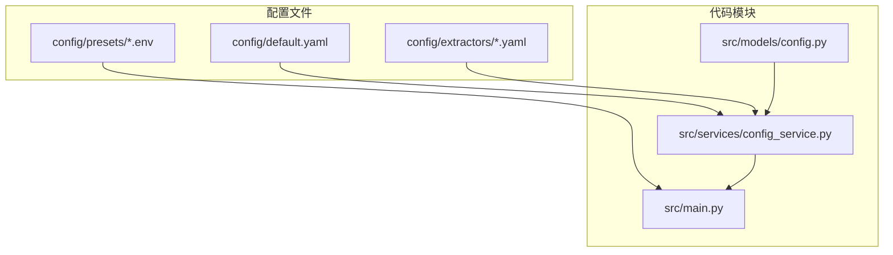
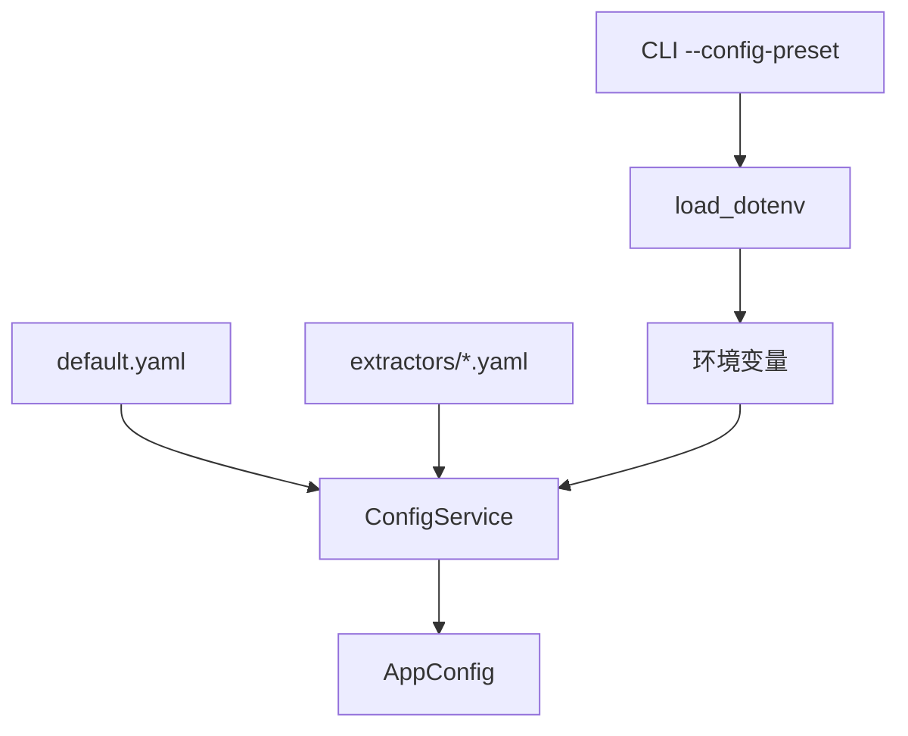
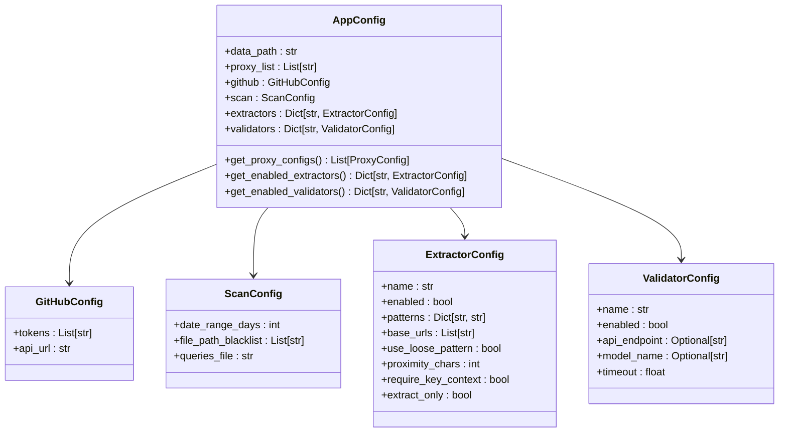
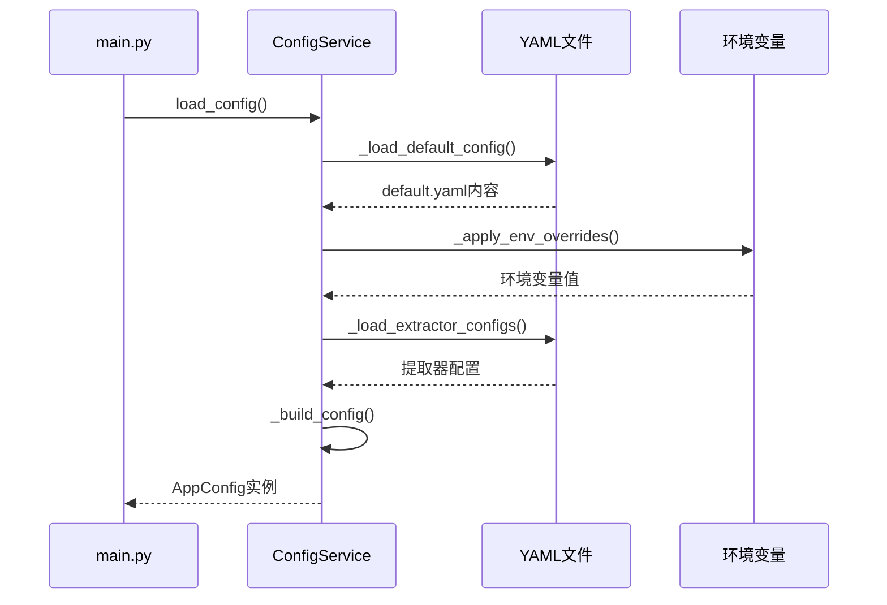
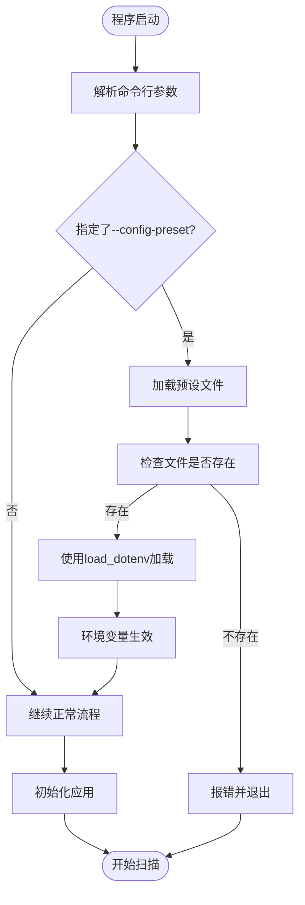
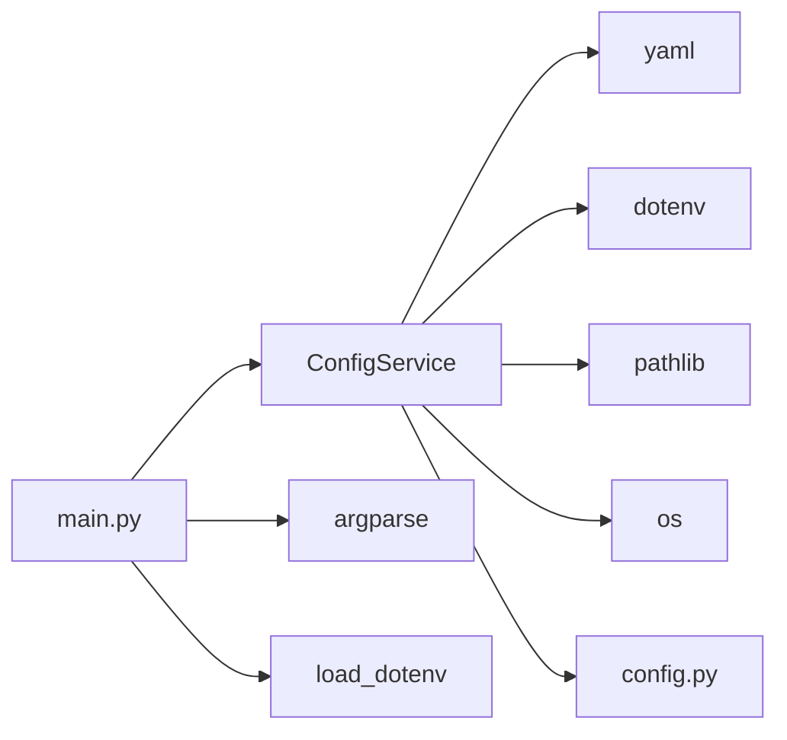

# 预设配置管理

<cite>
**本文档引用的文件**
- [default.yaml](file://config/default.yaml)
- [config.py](file://src/models/config.py)
- [config_service.py](file://src/services/config_service.py)
- [main.py](file://src/main.py)
</cite>

## 目录
1. [简介](#简介)
2. [项目结构](#项目结构)
3. [核心组件](#核心组件)
4. [架构概述](#架构概述)
5. [详细组件分析](#详细组件分析)
6. [依赖分析](#依赖分析)
7. [性能考虑](#性能考虑)
8. [故障排除指南](#故障排除指南)
9. [结论](#结论)

## 简介
本文档旨在介绍如何在 APIKEY-king 项目中创建和使用配置预设，包括环境变量预设和配置文件预设。通过预设机制，用户可以快速切换不同的扫描模式和配置，而无需手动修改多个配置文件或环境变量。

**Section sources**
- [main.py](file://src/main.py#L400-L451)

## 项目结构
APIKEY-king 项目的配置系统由多个组件组成，主要配置文件位于 `config/` 目录下，而配置管理逻辑则分布在 `src/models/` 和 `src/services/` 中。核心结构如下：

**Diagram sources**
- [config/default.yaml](file://config/default.yaml#L1-L18)
- [src/models/config.py](file://src/models/config.py#L1-L111)
- [src/services/config_service.py](file://src/services/config_service.py#L1-L215)
- [src/main.py](file://src/main.py#L1-L451)

**Section sources**
- [config/default.yaml](file://config/default.yaml#L1-L18)
- [src/models/config.py](file://src/models/config.py#L1-L111)

## 核心组件
本项目的核心配置管理组件包括：
- `AppConfig`：主应用配置数据类
- `ConfigService`：负责加载和合并配置的服务
- 预设机制：通过 `.env` 文件实现的配置预设

这些组件共同实现了从默认配置、YAML 文件、环境变量到预设文件的多层级配置加载机制。

**Section sources**
- [config.py](file://src/models/config.py#L1-L111)
- [config_service.py](file://src/services/config_service.py#L1-L215)

## 架构概述
配置管理系统的整体架构遵循优先级覆盖原则，从低到高依次为：
1. 默认配置（default.yaml）
2. 提取器特定配置（extractors/*.yaml）
3. 环境变量
4. 预设配置（通过 CLI 加载的 .env 文件）

**Diagram sources**
- [config_service.py](file://src/services/config_service.py#L1-L215)
- [main.py](file://src/main.py#L400-L451)

## 详细组件分析

### 配置模型分析
`AppConfig` 类定义了应用程序的所有配置选项，包括数据路径、代理设置、GitHub 配置、扫描配置以及提取器和验证器的配置。

**Diagram sources**
- [config.py](file://src/models/config.py#L1-L111)

### 配置服务分析
`ConfigService` 负责构建最终的配置对象，它按特定顺序加载和合并不同来源的配置。

**Diagram sources**
- [config_service.py](file://src/services/config_service.py#L1-L215)

### 预设配置机制分析
预设配置通过命令行参数 `--config-preset` 实现，加载 `config/presets/` 目录下的 `.env` 文件。

**Diagram sources**
- [main.py](file://src/main.py#L400-L451)

**Section sources**
- [main.py](file://src/main.py#L400-L451)

## 依赖分析
配置管理系统依赖于多个外部库和内部模块：

**Diagram sources**
- [config_service.py](file://src/services/config_service.py#L1-L10)
- [main.py](file://src/main.py#L1-L20)

**Section sources**
- [config_service.py](file://src/services/config_service.py#L1-L10)
- [main.py](file://src/main.py#L1-L20)

## 性能考虑
配置加载是一次性操作，在应用启动时完成。由于配置文件通常较小，且使用了缓存机制（`_config` 属性），因此对整体性能影响极小。

## 故障排除指南
当预设配置无法正常工作时，请检查以下几点：

**Section sources**
- [main.py](file://src/main.py#L430-L445)
- [config_service.py](file://src/services/config_service.py#L1-L215)

1. 预设文件是否存在于 `config/presets/` 目录下
2. 文件扩展名是否为 `.env`
3. 环境变量名称是否正确（区分大小写）
4. 是否有足够的文件读取权限
5. 命令行参数格式是否正确：`--config-preset preset_name`

## 结论
APIKEY-king 的预设配置系统提供了一种灵活且易于使用的方式来管理不同场景下的配置需求。通过结合 YAML 配置文件和环境变量预设，用户可以轻松实现配置的版本化管理和快速切换。