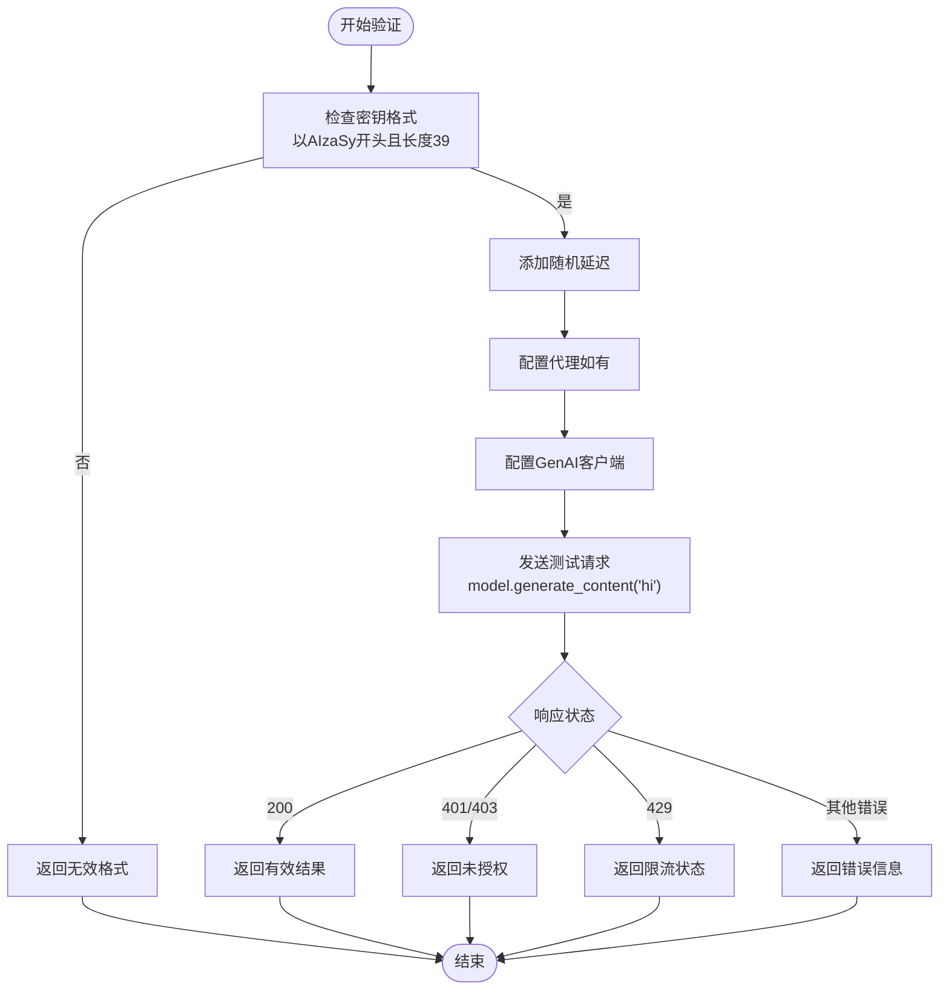
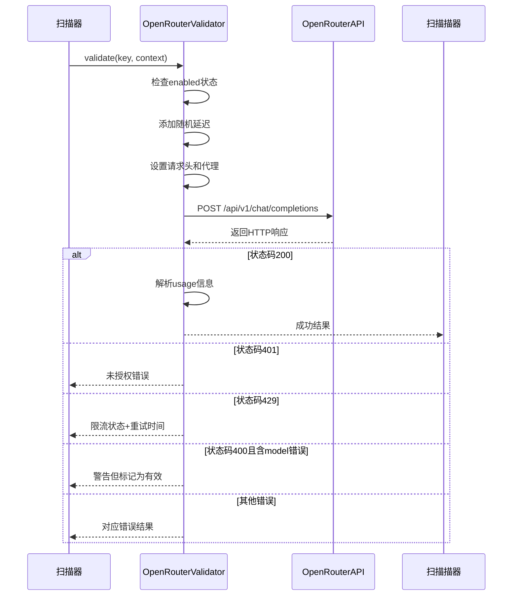

# 验证模式配置

<cite>
**本文档引用的文件**  
- [default.yaml](file://config/default.yaml)
- [base.py](file://src/validators/base.py)
- [gemini.py](file://src/validators/gemini.py)
- [openrouter.py](file://src/validators/openrouter.py)
- [modelscope.py](file://src/validators/modelscope.py)
- [gemini.yaml](file://config/extractors/gemini.yaml)
- [openrouter.yaml](file://config/extractors/openrouter.yaml)
- [modelscope.yaml](file://config/extractors/modelscope.yaml)
</cite>

## 目录
1. [简介](#简介)
2. [兼容模式](#兼容模式)
3. [Gemini专用模式](#gemini专用模式)
4. [OpenRouter专用模式](#openrouter专用模式)
5. [ModelScope专用模式](#modelscope专用模式)
6. [配置建议与最佳实践](#配置建议与最佳实践)
7. [故障排除指南](#故障排除指南)

## 简介
本指南详细说明APIKEY-king项目中支持的四种验证模式：兼容模式、Gemini专用模式、OpenRouter专用模式和ModelScope专用模式。每种模式对应不同的API密钥验证逻辑和配置方式，适用于不同平台的密钥检测场景。

**本文档引用的文件**  
- [default.yaml](file://config/default.yaml)
- [base.py](file://src/validators/base.py)

## 兼容模式
兼容模式是系统默认的验证行为，适用于未明确启用特定验证器的情况。该模式通过基础验证逻辑判断密钥格式是否符合通用规则，并支持通过环境变量或配置文件动态启用/禁用特定验证器。

在`config/default.yaml`中，可通过设置`enabled`字段控制各验证器的启用状态。若未显式启用某验证器，则其将处于禁用状态，返回“disabled”错误。

兼容模式的关键特性包括：
- 支持多平台密钥类型的自动识别
- 提供统一的验证结果结构
- 内置延迟机制防止速率限制
- 可通过配置灵活开关各类验证器

**Section sources**
- [base.py](file://src/validators/base.py#L0-L48)
- [default.yaml](file://config/default.yaml#L0-L18)

## Gemini专用模式
Gemini专用模式用于验证Google AI平台的Gemini API密钥。此模式通过调用Google Generative AI服务进行实际请求测试，确保密钥的有效性和服务可用性。

### 配置方法
1. 在`config/extractors/gemini.yaml`中定义密钥提取规则
2. 在`config/default.yaml`中启用Gemini验证器：
```yaml
validators:
  gemini:
    enabled: true
    api_endpoint: "generativelanguage.googleapis.com"
    model_name: "gemini-2.5-flash"
```
3. 可选配置代理以绕过网络限制

### 使用场景
- 扫描GitHub仓库中的Gemini API密钥
- 验证企业内部AI服务密钥的有效性
- 自动化密钥轮换流程中的有效性检查

### 验证逻辑
- 检查密钥是否以`AIzaSy`开头且长度为39位
- 调用`generativeModel.generateContent()`进行测试请求
- 根据HTTP响应码和异常类型判断结果状态

**Diagram sources**
- [gemini.py](file://src/validators/gemini.py#L0-L100)
- [gemini.yaml](file://config/extractors/gemini.yaml)



**Section sources**
- [gemini.py](file://src/validators/gemini.py#L0-L100)
- [gemini.yaml](file://config/extractors/gemini.yaml)

## OpenRouter专用模式
OpenRouter专用模式专为验证OpenRouter平台的API密钥设计，通过调用其聊天补全接口实现密钥有效性检测。

### 配置方法
1. 在`config/extractors/openrouter.yaml`中设置提取规则
2. 在`config/default.yaml`中启用OpenRouter验证器：
```yaml
validators:
  openrouter:
    enabled: true
    timeout: 30
```
3. 可配置代理服务器以适应不同网络环境

### 使用场景
- 批量验证从公开代码库提取的OpenRouter密钥
- 集成到CI/CD流程中自动检测密钥泄露
- 作为安全审计工具的一部分定期扫描

### 验证逻辑
- 检查密钥是否以`sk-or-v1-`开头
- 发送最小化请求（1 token，free模型）以降低成本
- 解析HTTP状态码和响应内容判断结果
- 特殊处理400错误：部分情况下仍视为有效

**Diagram sources**
- [openrouter.py](file://src/validators/openrouter.py#L0-L188)
- [openrouter.yaml](file://config/extractors/openrouter.yaml)



**Section sources**
- [openrouter.py](file://src/validators/openrouter.py#L0-L188)
- [openrouter.yaml](file://config/extractors/openrouter.yaml)

## ModelScope专用模式
ModelScope专用模式用于验证阿里云ModelScope平台的API密钥。虽然具体实现代码未提供，但根据项目结构可推断其配置方式与其他专用模式一致。

### 配置方法
1. 编辑`config/extractors/modelscope.yaml`定义密钥模式
2. 在`config/default.yaml`中启用验证器：
```yaml
validators:
  modelscope:
    enabled: true
    api_endpoint: "dashscope.aliyuncs.com"
```

### 使用场景
- 检测中国开发者常用的ModelScope平台密钥
- 企业内部AI平台密钥管理
- 多云环境下的统一密钥验证

**Section sources**
- [modelscope.py](file://src/validators/modelscope.py)
- [modelscope.yaml](file://config/extractors/modelscope.yaml)

## 配置建议与最佳实践
- **安全性**：避免在配置文件中硬编码敏感信息，使用环境变量替代
- **性能**：合理设置`timeout`和延迟参数，平衡验证速度与成功率
- **成本控制**：对于付费API，使用最小请求量进行验证
- **代理配置**：在受限网络环境中正确设置HTTP/HTTPS代理
- **日志级别**：生产环境建议使用INFO级别，调试时可设为DEBUG

**Section sources**
- [default.yaml](file://config/default.yaml#L0-L18)
- [base.py](file://src/validators/base.py#L0-L48)

## 故障排除指南
常见问题及解决方案：

| 问题现象 | 可能原因 | 解决方案 |
|--------|--------|--------|
| 验证始终失败 | 密钥格式不匹配 | 检查密钥前缀和长度是否符合要求 |
| 出现速率限制 | 请求过于频繁 | 增加延迟时间或使用代理轮换 |
| 连接超时 | 网络不通或代理配置错误 | 检查代理设置或更换网络环境 |
| 403 Forbidden | 服务未启用或权限不足 | 确认API服务已启用并具有相应权限 |
| JSON解析错误 | 响应格式异常 | 检查API端点是否正确 |

**Section sources**
- [gemini.py](file://src/validators/gemini.py#L0-L100)
- [openrouter.py](file://src/validators/openrouter.py#L0-L188)
- [base.py](file://src/validators/base.py#L0-L48)